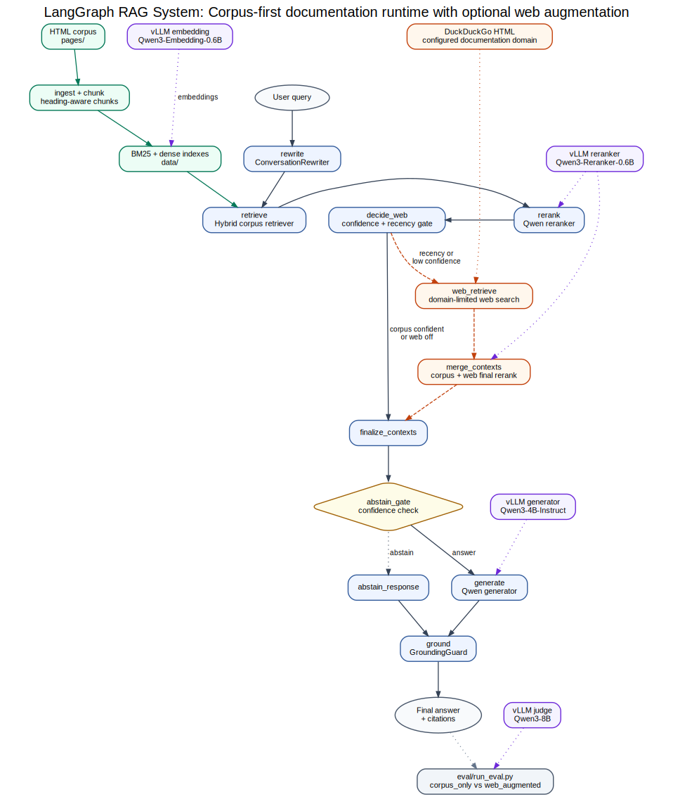

# LangGraph RAG Chatbot



This project is a corpus-first RAG chatbot over an Autodesk HTML snapshot. It uses
LangGraph for orchestration, hybrid retrieval over a cleaned local corpus, Qwen/vLLM
model services for embedding, reranking, generation, and judging, plus an evaluation
harness for corpus-only and optional web-augmented runs.

The current recommended mode is **corpus-only**. The optional web augmentation branch is
implemented and tested, but the current DuckDuckGo HTML provider did not return useful web
evidence in the latest A/B run, so `web.enabled=false` remains the default.

## What Is Included

- Corpus ingestion from raw HTML pages into clean, metadata-rich documents.
- Heading-aware chunking and local indexes:
  - dense vector search with `Qwen3-Embedding-0.6B`
  - lexical search with BM25
  - Reciprocal Rank Fusion hybrid retrieval
- Qwen reranking from retrieval candidates to final contexts.
- Grounded generation with inline citations.
- Conversation rewrite, abstention, and grounding guard nodes.
- Evaluation reports for retrieval, generation faithfulness, citation behavior, abstention, and latency.
- Optional web-search branch for freshness questions.

## Repository Layout

```text
langgraph_rag/
  app/                 # CLI and sample-answer runner
  config/settings.yaml # paths, model endpoints, feature flags, thresholds
  core/                # config, registry, interfaces, shared state
  eval/                # golden set, judge, metrics, eval runner
  generate/            # answer generation and prompts
  graph/               # LangGraph node wrappers and graph assembly
  guards/              # conversation rewrite, abstention, grounding
  ingest/              # corpus cleaning, metadata, chunking, index build
  retrieval/           # dense, BM25, hybrid, optional web retrievers
  rerank/              # Qwen reranker and passthrough reranker
  obs/                 # report helpers
tests/                 # phase-level tests
reports/               # build reports, eval reports, graphs, sample answers
data/                  # generated clean docs, chunks, indexes, golden set
pages/                 # raw HTML corpus
```

## Corpus Statistics

The raw snapshot contains 1,218 HTML files. After extraction, filtering, and deduplication,
729 documents are kept.

```json
{
  "total_files": 1218,
  "kept": 729,
  "dropped": {
    "empty_after_extraction": 238,
    "too_small": 2,
    "duplicate_content": 184,
    "dropped_page_type": 64,
    "non_english": 1
  }
}
```

The resulting index currently contains 1,494 chunks. See
[reports/corpus_stats.md](reports/corpus_stats.md) and
[reports/BUILD_REPORT.md](reports/BUILD_REPORT.md) for the full selection rationale.

## Architecture

Runtime flow:

```text
query
  -> optional conversation rewrite
  -> hybrid retrieve: dense embedding search + BM25, fused by RRF
  -> Qwen reranker
  -> optional web gate and web merge, disabled by default
  -> abstention gate
  -> Qwen generator with citations
  -> grounding guard
```

Important details:

- Retrieval is not a generative LLM call.
- Dense retrieval embeds the query and compares it against precomputed chunk embeddings.
- BM25 protects exact terms such as product names, version strings, and `AutoCAD LT`.
- Hybrid retrieval uses Reciprocal Rank Fusion, avoiding direct comparison between BM25 and cosine scores.
- The reranker is a separate Qwen cross-encoder stage after retrieval.
- The judge model is different from the generator to reduce self-evaluation bias.

Graph artifacts:

- [reports/graphs/system_graph.svg](reports/graphs/system_graph.svg)
- [reports/graphs/system_graph.png](reports/graphs/system_graph.png)
- [reports/graphs/langgraph_corpus_only.mmd](reports/graphs/langgraph_corpus_only.mmd)
- [reports/graphs/langgraph_web_augmented.mmd](reports/graphs/langgraph_web_augmented.mmd)

## Environment Setup

The project uses two layers:

1. **Orchestration environment:** lightweight Python env for LangGraph, retrieval, ingestion,
   tests, and eval orchestration.
2. **Model-serving environment:** vLLM servers expose OpenAI-compatible HTTP endpoints.

### Fresh Orchestration Env

From a clean machine with conda:

```bash
conda create -n langgraph-rag python=3.11 -y
conda activate langgraph-rag
git clone git@github.com:hosseinbv/RAG-System.git
cd RAG-System
python -m pip install --upgrade pip
python -m pip install -r requirements.txt
python -m pytest -q
```

`requirements.txt` intentionally does not install torch/vLLM. The RAG code talks to model
services over HTTP.

## Model Services

Model endpoints are configured in [langgraph_rag/config/settings.yaml](langgraph_rag/config/settings.yaml).

Current services:

| Role | Model | Port |
| --- | --- | --- |
| Generator | `Qwen3-4B-Instruct-2507` | `8001` |
| Embedding | `Qwen3-Embedding-0.6B` | `8002` |
| Reranker | `Qwen3-Reranker-0.6B` | `8003` |
| Judge | `Qwen3-8B` | `8004` |

Start the services with:

```bash
bash serve_models.sh all
```

For evaluation, include the judge:

```bash
bash serve_models.sh eval
```

Check service status:

```bash
bash serve_models.sh status
```

The script defaults to `GPU=4`. Override it if needed:

```bash
bash serve_models.sh eval
```

Logs are written under [logs/](logs/).

## Build Or Refresh Data

The checked-in/generated data is already present on this machine. To rebuild from the raw HTML:

```bash
python -m langgraph_rag.ingest.build_corpus
```

Then rebuild chunks:

```bash
python -m langgraph_rag.ingest.chunk
```

Then rebuild indexes:

```bash
python -m langgraph_rag.ingest.build_index
```

Index building consumes `data/chunks.jsonl` and requires the embedding service on port `8002`.

## Run The Chatbot

Browser UI:

```bash
streamlit run langgraph_rag/app/streamlit_app.py --server.port 8501 --server.address 0.0.0.0 --server.headless true
```

Then open:

```text
http://localhost:8501
```

The browser UI stores chats locally under:

```text
data/ui/sessions/
```

Saved sessions can be created, loaded, cleared, and deleted from the sidebar. Per-answer
feedback is stored locally as append-only JSONL:

```text
data/ui/feedback.jsonl
```

Feedback records include the session/turn id, query, answer, citations, final context ids,
source URLs, trace/metric fields, label, optional comment, and timestamp.

The sidebar also has an Admin view for inspecting eval reports, A/B deltas, feedback records,
sample answers, and source artifact paths.

Single query:

```bash
python -m langgraph_rag.app.cli "What does Fusion 360 do?"
```

Interactive mode:

```bash
python -m langgraph_rag.app.cli
```

Generate the current sample-answer report:

```bash
python -m langgraph_rag.app.run_samples
```

Sample outputs are documented in
[reports/sample_answers_corpus_only.md](reports/sample_answers_corpus_only.md).

## Run Tests

Offline/unit test suite:

```bash
python -m pytest -q
```

Current verification status:

```text
46 passed, 3 skipped
```

The skipped tests are gated integration/live-service checks. Unit tests do not require live
internet access.

Run a focused phase test:

```bash
python -m pytest tests/test_phase5_web.py -q
```

## Run Evaluation

The golden set lives at [data/golden_set.jsonl](data/golden_set.jsonl). It currently has
48 items: 40 synthetic plus 8 curated.

Run corpus-only eval:

```bash
python -m langgraph_rag.eval.run_eval --condition corpus_only
```

Run web-augmented eval:

```bash
python -m langgraph_rag.eval.run_eval --condition web_augmented
```

Run a smaller smoke eval:

```bash
python -m langgraph_rag.eval.run_eval --condition corpus_only --limit 10
```

Evaluation writes:

- `reports/eval_report_corpus_only.json`
- `reports/eval_report_web_augmented.json`
- `reports/eval_items_corpus_only.jsonl`
- `reports/eval_items_web_augmented.jsonl`
- `reports/eval_report_ab.md`
- `reports/eval_report_ab.json`

The latest A/B report is here:
[reports/eval_report_ab.md](reports/eval_report_ab.md).

## Current Results Snapshot

Latest A/B summary:

- Retrieval is unchanged between corpus-only and web-augmented because the retrieval metrics
  score corpus candidates.
- Web triggered on a small number of freshness-shaped questions.
- The current web provider returned no final web evidence in the latest run.
- Corpus-only remains the recommended default.

See [reports/eval_report_ab.md](reports/eval_report_ab.md) for the exact metric table.

## Useful Project Documents

- [reports/BUILD_REPORT.md](reports/BUILD_REPORT.md): append-only build/eval log with decisions,
  metrics, artifacts, and follow-up notes.
- [reports/eval_report_ab.md](reports/eval_report_ab.md): corpus-only vs web-augmented comparison.
- [reports/sample_answers_corpus_only.md](reports/sample_answers_corpus_only.md): current sample
  answers with citations, abstention examples, and latency traces.
- [reports/graphs/system_graph.svg](reports/graphs/system_graph.svg): architecture overview figure.

## Configuration

Most behavior is controlled by [langgraph_rag/config/settings.yaml](langgraph_rag/config/settings.yaml):

- corpus and report paths
- model base URLs and model names
- ingestion and chunking settings
- retrieval `top_k`
- reranker `top_n`
- abstention threshold
- optional web branch settings

Important defaults:

```yaml
retrieval:
  top_k: 20

rerank:
  enabled: true
  top_n: 5

web:
  enabled: false
```

## Notes And Caveats

- The corpus snapshot is from Dec 2023, so recency questions can be stale.
- Web augmentation is implemented but should stay disabled until the provider/query layer is improved.
- The LLM judge validation set is a small smoke test, not a production-grade human annotation set.
- `gold_doc_cited_rate` is intentionally strict: a faithful answer can cite an overlapping Autodesk
  page and still miss the exact synthetic gold document.
